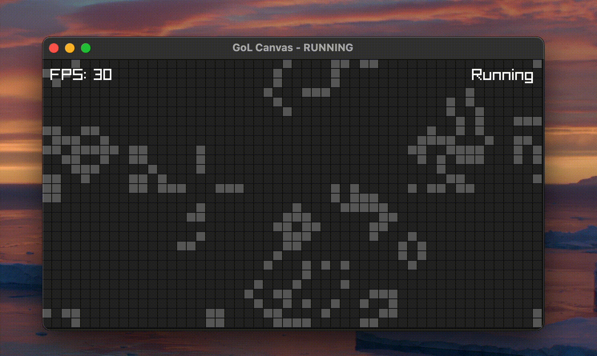

# Cellular Automata

---

###  Overview
This is an effort to build an open-source cellular automata engine in C++ with raylib. Currently, this program is able to
simulate Conway's game of life with the following features:
- Customizable environment and cell sizes
- Customizable colors
- Adjustable framerate
- Cell clearing, randomization, and cell placement using the mouse

GitHub will serve as our primary platform for code.



**USAGE GUIDE**

| Key   | Function           |
|-------|--------------------|
| A     | decrease fps limit |
| C     | clear grid         |
| P     | color picker       |
| R     | randomize grid     |
| F     | fps counter        |
| N     | change environment |
| LMB   | place cell         |
| RMB   | remove cell        |
| ENTER | toggle simulation  |
| ESC   | quit program       |
| Q     | keybind guide      |


---

## Table of Contents
1. [Project Goals](#project-goals)
2. [Repository Structure](#repository-structure)
3. [Tech Stack](#tech-stack)
4. [Git Conventions](#git-conventions)
    - [Branching](#branching)
    - [Commits](#commits)
    - [Pull Requests](#pull-requests)
    - [Code Style](#code-style)
5. [Getting Started](#getting-started)
6. [Contribute](#contribute)
7. [Contributors](#contributors)

---

## Project Goals
- Implement an application which allows for the simulation of various forms of cellular automata
- Make the application as extendable as possible

---

## Source Structure
This project uses a flat structure, that is, all implementation and header files are located within the topmost directory.

---

## Tech Stack
We'll be using the following tools to develop, test, and debug this program:

- **Programming Language:** [C++](https://en.wikipedia.org/wiki/C%2B%2B)
- **Graphics** [raylib](https://www.raylib.com/)
- **GUI** [raygui](https://github.com/raysan5/raygui)
- **Build System Generator:** [CMake](https://cmake.org/)

---

## Git Conventions
To keep our work organized and manageable, we'll adhere to these conventions:

### **Branching**
- **`main` branch:** Stable and working code only
- **Feature branches (`feature/<name>`):** For new features
- **Bugfix branches (`bugfix/<name>`):** For retroactively resolving issues

### **Commits**
To keep things nice and organized, please prepend a relevant **type** seen
in the table below to your commit message.

Example:  ```feat(gui): Implement neural vetwork visualizer```

| Type      | Purpose |
|-----------|---------|
| **feat**  | Introduces a new feature |
| **fix**   | Fixes a bug |
| **chore** | Maintenance tasks |
| **docs**  | Documentation changes |
| **style** | Formatting, whitespace, missing semicolons, etc. |
| **refactor** | Code restructuring without changing behavior |
| **test**  | Adding or updating tests |
| **perf**  | Performance improvements |
| **build** | Changes to build scripts, dependencies |


### **Pull Requests**
- Always create a PR before merging into `main`.
- PRs should be reviewed.
- Include a description of what the PR does.
- Run tests before submitting a PR.

---

## Getting Started

### **Prerequisites**
This project was created with CLion, but any proper C/C++ development environment should suffice.


### **Procedure**

The following steps are outlined using CLI tools to provide an environment-agnostic
guide to setting this project up. If you want to avoid using the below CLI commands, most
modern IDEs ship with their own respective GUI tools that achieve the same thing. For instance,
CLion users can follow [this reference](https://www.jetbrains.com/help/idea/using-git-integration.html), it's targeted towards IntelliJ,
but the procedure is almost the exact same for CLion.

1. **Clone the repository:**
```shell
  git clone https://github.com/gjinrexhaj/java-neural-network.git
```
3. **Create a feature branch before working on a new task:**
```shell
  git checkout -b feature/<your-feature-name>
```
4. **Commit changes regularly:**
```shell
   git add <changed-files>
   git commit -m "(Type): Message")>
```
5. **Push your branch and create a pull request:**
```shell
   git push origin feature/<your-feature-name>
```

---

## Contribute
To keep our project organized and productive, please:
- **Open an Issue Before Major Changes**
- **Follow Coding Standards:** Keep naming and formatting consistent, avoid creating spaghetti-code when possible
- **Test Your Code Thoroughly:** Make sure it works before merging.
- **Review PRs:** Look for clarity, correctness, and efficiency.

---

## Contributors
<a href="https://github.com/gjinrexhaj"></a>